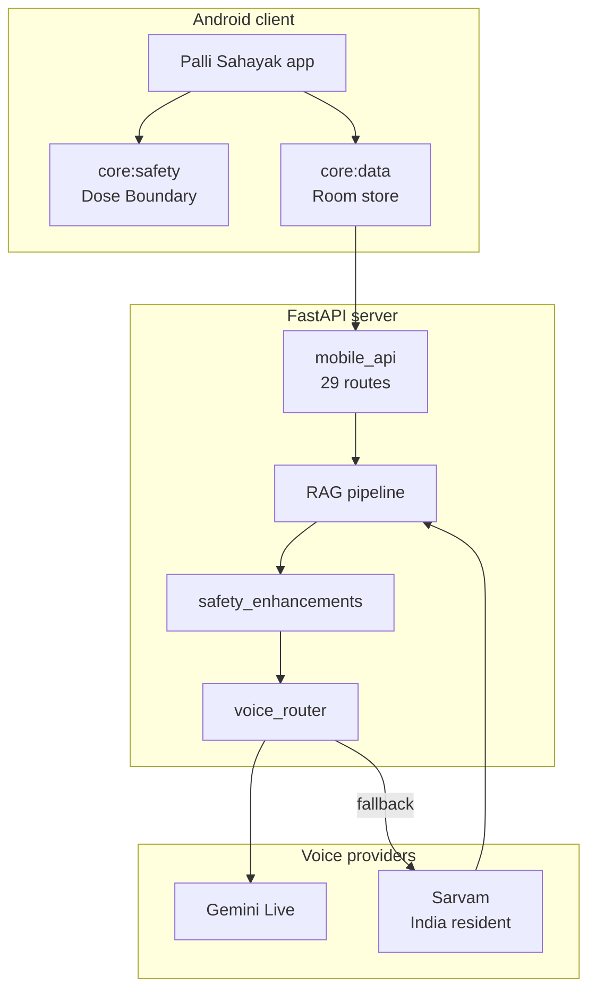

# Palli Sahayak

A voice-first clinical decision support system for frontline health workers in
India. It answers clinical questions in eleven Indic languages. It grounds every
answer in a pinned knowledge base. It refuses to give a specific dose. It records
every interaction so the study can measure adoption and safety.

The system runs under an approved study protocol. That changes several engineering
decisions, and this page links to the records that state them.

## Start here

| Document | What it answers |
|---|---|
| [Resume brief](HANDOVER.md) | Where the work stopped, what is unfinished, and what cost time |
| [Decisions](adr/0001-one-app-three-care-roles.md) | What was chosen, and what was rejected |

## Read this first

The most dangerous defect found in this project was silent. A retrieval index built
with an English-only model scored 0.00 on all ten Indic languages while scoring 1.00
on English. Nothing raised an error. A Marathi question returned confident,
unfounded palliative guidance.

The pipeline now refuses to serve through a mismatched index. That is why the
architecture documents below spend as much time on what fails closed as on what
works.

## The three rules

**The dose boundary.** The system never states a specific dose, strength, titration
step, or start decision. The line sits at the dose, not at whether a medicine is
sold over the counter. Over-the-counter is not a safety property for this cohort.
These patients have advanced kidney and liver disease, and a free medicine can still
harm them.

**One safety path.** Text and voice share one grounding pipeline and one dose
boundary. A second answer generator would mean a second set of rules, and a second
set of rules is one that can drift from the first.

**One study log.** Every interaction is recorded on the server, not on the device.
The device sends requests. The server decides what to keep.

## Architecture in one diagram

## The voice path

A user holds the microphone button and speaks. The client sends audio. The server
answers with text and audio.

Gemini Live is the primary provider. Sarvam is the fallback, and it runs in India.
The router picks between them by measured health rather than by whether a socket
opened, because a session that connects and then goes quiet is worse than one that
never connects.

An administrator can force the fallback for the whole deployment. The change needs
an actor and a reason, and it is audited. Forced and automatic fallbacks are counted
separately, so incident response does not look like provider failure.

## Retrieval

Questions are matched in the language the user spoke. Translation is a fallback, not
a step.

| Measure | bge-m3 | LaBSE | Previous index |
|---|---|---|---|
| Mean hit at 5 | **0.96** | 0.72 | 0.09 |
| Lowest language | 0.78 | 0.56 | 0.00 |
| Dimensions | 1024 | 471 | 384 |

The previous index scored 1.00 on English and 0.00 on every Indic language. That is
the failure described at the top of this page.

## How this site is built

This site is generated, not hand-written. It is rebuilt on every push to `main`, so
it cannot drift from the code. A CI job also fails the build if the generated code
reference is stale.